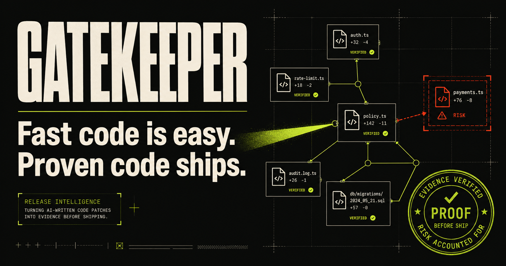
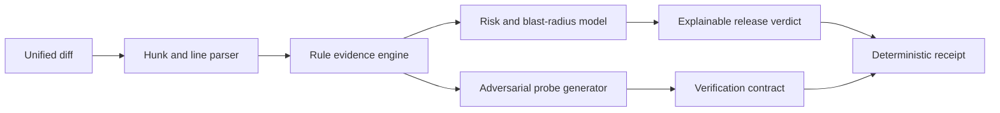

# Gatekeeper

> Fast code is easy. Proven code ships.

Gatekeeper is a local-first release intelligence tool for AI-written code. Paste any unified diff and it turns the change into a reviewable evidence chain: a parsed change map, trust-boundary findings, adversarial verification commands, and a deterministic release receipt.

Built with **Codex + GPT-5.6** for **OpenAI Build Week 2026** in the Developer Tools category.



## Why Gatekeeper

AI coding agents make implementation dramatically faster, but review bandwidth has not grown with them. Teams face a new bottleneck: understanding which generated changes deserve trust and why.

Gatekeeper does not ask reviewers to trust another opaque score. It exposes the evidence behind the score and converts each risky claim into a concrete hostile test. The result is a portable release contract that a human or CI system can reproduce.

## What it does

- **Parses real unified diffs** into files, hunks, additions, deletions, and line-level evidence.
- **Detects trust-boundary regressions** in authentication, authorization, data access, money movement, error handling, secrets, and test controls.
- **Maps blast radius** from the number and size of touched surfaces.
- **Derives adversarial probes** such as forged roles, foreign-audience tokens, SQL injection payloads, concurrent payment replay, and dependency interruption.
- **Calculates an explainable release verdict** from visible rules and severity weights.
- **Exports a deterministic Markdown receipt** with a stable fingerprint, risks, and verification contract.
- **Runs locally in the browser**; pasted source is never uploaded.

## Try the demo

The app opens on a deliberately vulnerable admin-access patch. Three case files are included:

1. **Auth shortcut** — catches caller-controlled role escalation and a skipped security test.
2. **Payment retry** — exposes a missing idempotency boundary and swallowed failure.
3. **Safe refactor** — demonstrates a clean change that still receives a verification contract.

Select a case, inspect its findings and annotated diff, run the proof suite, then export the release receipt. You can also choose **Analyze a diff** and paste any unified diff of your own.

## Run locally

Requirements: Node.js 22.13 or newer.

```bash
npm install
npm run dev
```

Open [http://localhost:3000](http://localhost:3000).

Validation:

```bash
npm test
npm run lint
npm run build
```

## Architecture



The analysis engine is deliberately deterministic. The same patch produces the same findings, score, probes, case identifier, and receipt fingerprint. This makes the output reviewable and testable instead of dependent on a probabilistic response at release time.

Key modules:

| Module | Responsibility |
| --- | --- |
| `lib/analyzer.ts` | Diff parser, evidence rules, scoring, probe derivation, receipt fingerprinting |
| `lib/demos.ts` | Realistic judge-ready demo patches |
| `app/page.tsx` | Interactive review console, proof simulation, receipt export |
| `app/globals.css` | Responsive product visual system and accessible states |
| `tests/analyzer.test.ts` | Regression tests for risky, safe, and deterministic behavior |

See [docs/ARCHITECTURE.md](docs/ARCHITECTURE.md) for design decisions and extension points.

## How Codex and GPT-5.6 were used

Gatekeeper was designed and implemented in one concentrated Codex session. Codex was responsible for:

- researching the official challenge requirements and judging criteria;
- comparing product directions against implementation depth, design, impact, and originality;
- scaffolding the Cloudflare-compatible Next.js/vinext application;
- designing and implementing the diff-analysis engine and its tests;
- constructing the complete responsive interface and interactions;
- creating the product-specific social preview;
- running tests, lint, and production builds and correcting failures;
- preparing the repository, documentation, Devpost copy, and demo script.

The most important human-product decision made with Codex was to keep the release verdict deterministic and evidence-first. A second LLM response would have looked impressive, but it would make the release gate harder to audit and impossible to reproduce exactly. GPT-5.6 was used where its strengths mattered most—rapid system design, implementation, rule design, UX composition, and verification—while the shipped runtime stays local, fast, private, and testable.

Majority-build Codex session: `019f8693-7d3a-7a20-9749-7f6369247919`

## Current scope and next steps

This Build Week release analyzes JavaScript/TypeScript-style patches in-browser with a compact, transparent ruleset. A production version would add language adapters, AST/data-flow analysis, repository context, CI annotations, signed receipts, and execution of generated probes inside isolated sandboxes.

## License

[MIT](LICENSE)
